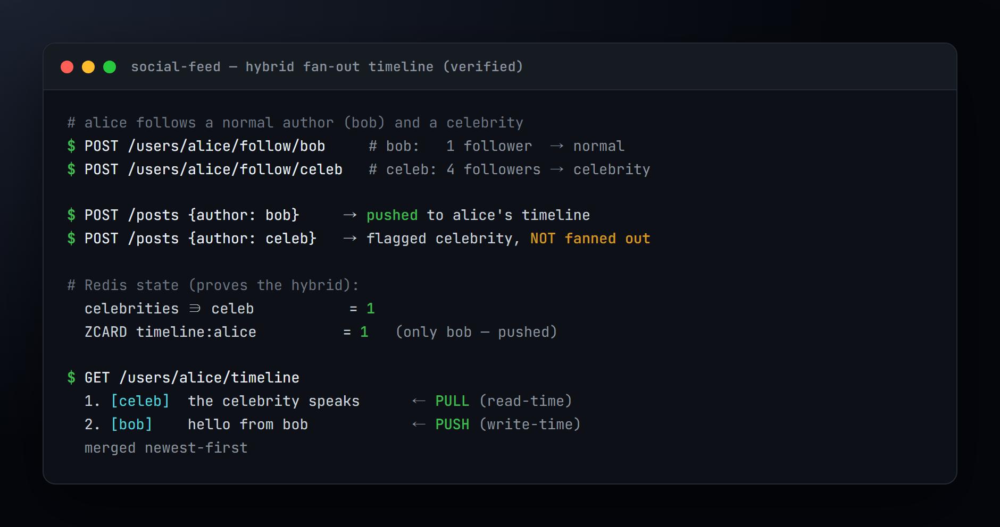
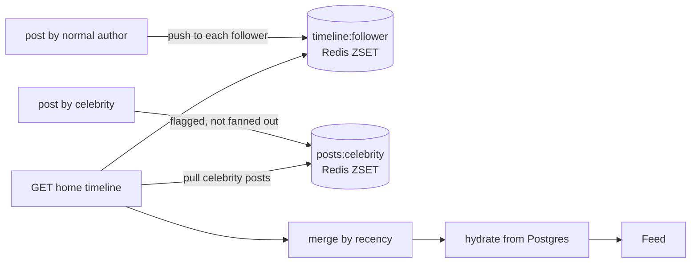

# Social Feed

A follow-graph feed service built for the read-heavy hot path: a home timeline assembled with a
**hybrid fan-out** — push for normal authors, pull for celebrities — over Redis sorted sets, with
PostgreSQL as the source of truth.

> **Status:** active build. Milestone 1 (hybrid fan-out timeline) is implemented and verified
> end-to-end. This README is honest about what runs today vs. what is roadmap.


---

## Demo

The hybrid fan-out timeline — normal author pushed, celebrity pulled, merged newest-first:



## The problem

A home timeline is read far more than it is written, so the read has to be cheap. Pre-computing each
user's timeline on write (**fan-out on write**) makes a read a single range scan — but a post from an
account with millions of followers becomes millions of writes (the **celebrity problem**). Computing
the timeline on every read (**fan-out on read**) makes writes cheap but reads expensive.

## Approach — hybrid fan-out

- **Normal author posts →** push the post id onto each follower's `timeline:{userId}` Redis sorted
  set (scored by time). Reads are one `ZREVRANGE`.
- **Celebrity author (followers > threshold) →** skip the fan-out, flag the author, and pull their
  recent posts from `posts:{authorId}` at read time, merging into the timeline.



See [ADR-0001](docs/adr/0001-fan-out-strategy.md).

## Behaviour — verified end-to-end

With the celebrity threshold set low for the demo, `alice` follows a **normal author** (`bob`) and a
**celebrity** (followed by enough users to cross the threshold):

- `bob` posts → the post is **pushed** to `alice`'s pre-computed timeline.
- the celebrity posts → **not fanned out**; flagged instead.
- `GET /users/{alice}/timeline` returns **both** posts, newest first — the celebrity's via the
  read-time **pull**, `bob`'s via the **push** — merged into one feed.

Covered by [`FanOutTest`](src/test/java/com/portfolio/socialfeed/FanOutTest.java) against
Testcontainers Postgres + Redis.

## Tech stack

- **Java 21**, **Spring Boot 4.1**, Spring Data JPA (Hibernate)
- **PostgreSQL** + **Flyway** — source of truth for users, follows, posts
- **Redis** sorted sets — timelines and author feeds
- **Testcontainers** for integration tests

## Quickstart

```bash
docker compose up -d          # Postgres (:5433) + Redis (:6380)
./gradlew bootRun             # app on :8095
```

```bash
# create users, follow, post, read the timeline
A=$(curl -s localhost:8095/users -H 'Content-Type: application/json' -d '{"handle":"alice"}' | jq -r .id)
B=$(curl -s localhost:8095/users -H 'Content-Type: application/json' -d '{"handle":"bob"}'   | jq -r .id)
curl -s -X POST localhost:8095/users/$A/follow/$B
curl -s localhost:8095/posts -H 'Content-Type: application/json' -d "{\"authorId\":\"$B\",\"content\":\"hello\"}"
curl -s "localhost:8095/users/$A/timeline"
```

## API

| Method | Path | Notes |
|---|---|---|
| `POST` | `/users` | `{ handle }` → user |
| `POST` | `/users/{id}/follow/{targetId}` | follow |
| `POST` | `/posts` | `{ authorId, content }` → post (fans out) |
| `GET` | `/users/{id}/timeline?limit=20` | home timeline (hybrid fan-out) |

## Project layout

```
src/main/java/com/portfolio/socialfeed
├── user/       users + handles
├── follow/     follow graph (composite-key edges)
├── post/       posts + fan-out on write
├── timeline/   Redis sorted-set store + hybrid read
└── web/        REST API + error handling
```

## Roadmap

- Async fan-out through a queue for very large follower sets.
- Rebuild timelines from the Postgres source of truth after a Redis failure.
- Cursor (keyset) pagination for the timeline.

## Decision records

- [ADR-0001 — Hybrid fan-out for the home timeline](docs/adr/0001-fan-out-strategy.md)
